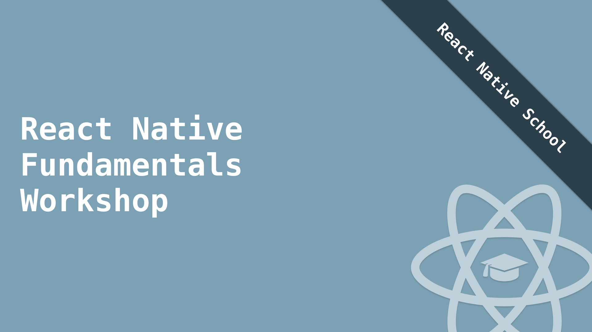

<a href="https://www.reactnativeschool.com/react-native-fundamentals-workshop/" target="_blank">
  
</div>

# React Native Fundamentals

This [self-guided workshop](https://www.reactnativeschool.com/react-native-fundamentals-workshop/) aims to get you up and running with React Native and understand the fundamentals.

Prepared by [React Native School](https://www.reactnativeschool.com/).

## Helpful Links

If at any point you feel lost or like you're missing "something" outside of the scope of the lessons please check out these articles to help fill any gaps.

Each lesson also provides links to further your knowledge on the topic at hand.

- [JavaScript Essentials](https://www.reactnativeschool.com/javascript-essentials)
- [A Brief Overview of ES6 for React Native Developers](https://www.reactnativeschool.com/a-brief-overview-of-es6-for-react-native-developers)
- [JSX In Depth](https://reactjs.org/docs/jsx-in-depth.html)

## System Setup

We'll be leveraging [Expo](https://expo.io/) in this workshop. It makes React Native development very easy to get started with (it also provides a great way to build large React Native apps as well).

Follow the [Expo installation documentation](https://expo.io/learn) for your machine. Once complete, you should have Expo installed on your computer and the app installed on your phone.

You'll also want to [install Git](https://git-scm.com/book/en/v2/Getting-Started-Installing-Git).

Once complete the following tools should be available on your system.

- Node
- npm
- Git
- Expo

You can check installation by running the following commands:

```
node --version
npm --version
git --version
expo --version
```

## Project Setup

From the command line, run the following commands.

```
git clone https://github.com/ReactNativeSchool/react-native-fundamentals.git
cd react-native-fundamentals
npm install
```

## Running the App

With the project installed you can start the project by running `npm start`.

This will output a QR code in your terminal which you can scan from the Expo app (Android) or the Camera app (iOS).

- [Expo iOS App](https://itunes.apple.com/app/apple-store/id982107779)
- [Expo Android App](https://play.google.com/store/apps/details?id=host.exp.exponent&referrer=www)

Once that is complete shake your device (yes, physically shake it) at which point a menu should pop up.

Make sure that Fast Refresh is enabled.

With this complete the app will now refresh with the latest code any time you save a file.

## Exercises

You can find a pre-made file for each exercise in the `exercises` directory. Each exercise has a `.js` file and `.md` file. The `.md` files will give you context about what you're doing and give you the exercise(s). The `.js` file will be where you do your work.

> Important: Make sure you use `export default` from the exercise js file so that the app can pick up your code.

You can find solutions for each exercise in the `solutions` folder (they use the same file name).

1. [Exercise 1 - Hello, World!](./exercises/hello-world.md)
2. [Exercise 2 - Capturing Taps](./exercises/capturing-taps.md)
3. [Exercise 3 - Building a Custom Component](./exercises/custom-component.md)
4. [Exercise 4 - State & Props](./exercises/state-props.md)
5. [Exercise 5 - Styling](./exercises/styling.md)
6. [Exercise 6 - Scrolling Content](./exercises/scrollable-content.md)
7. [Exercise 7 - Building a Form](./exercises/building-a-form.md)
8. [Exercise 8 - Long Scrolling Lists](./exercises/long-lists.md)
9. [Exercise 9 - Working with Remote APIs](./exercises/working-with-api.md)
10. [Exercise 10 - Splitting Code into Multiple Files](./exercises/multiple-files.md)
11. [Exercise 11 - Class Components](./exercises/class-components.md)
12. [Exercise 12 - Component Lifecycle](./exercises/component-lifecycle.md)

## Credit

This workshop (concept and structure) is heavily inspired by Kent C. Dodds' [React Fundamentals](https://github.com/kentcdodds/react-fundamentals) workshop. Thank you for putting it together and sharing it publicly.

[Kent's React Fundamentals Workshop](https://kentcdodds.com/workshops/react-fundamentals)
